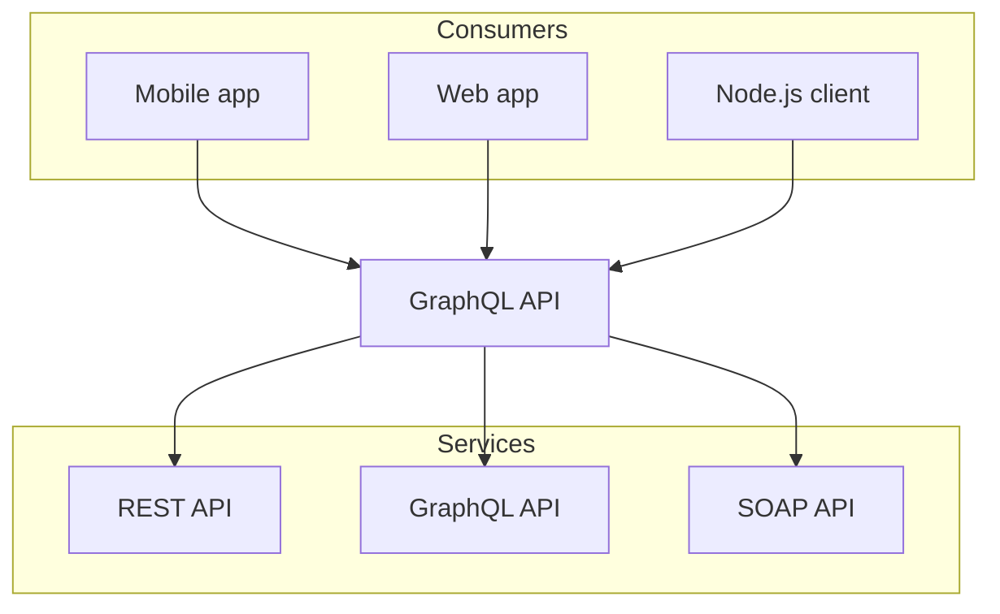

# Kitchen Sink

## Nextra Built-ins

### Callout

https://nextra.site/docs/guide/built-ins/callout

<Callout emoji='👾'>
  **Space Invaders** is a 1978 shoot 'em up arcade game developed by Tomohiro
  Nishikado.
</Callout>

<Callout type='info' emoji='ℹ️'>
  Today is Friday.
</Callout>

<Callout type='warning' emoji='⚠️'>
  This API will be deprecated soon.
</Callout>

<Callout type='error' emoji='️🚫'>
  This is a dangerous feature that can cause everything to explode.
</Callout>

### Cards

https://nextra.site/docs/guide/built-ins/cards

<Cards>
  <Card
    icon={<span>🚫</span>}
    title='Callout'
    href='/docs/guide/built-ins/callout'
  />
  <Card icon={<span>🚫</span>} title='Tabs' href='/docs/guide/built-ins/tabs' />
  <Card icon={<span>🚫</span>} title='Steps' href='/docs/guide/built-ins/steps' />
</Cards>

### FileTree

https://nextra.site/docs/guide/built-ins/filetree

<FileTree>
  <FileTree.Folder name='pages' defaultOpen>
    <FileTree.File name='_meta.json' />
    <FileTree.File name='contact.md' />
    <FileTree.File name='index.mdx' />
    <FileTree.Folder name='about'>
      <FileTree.File name='_meta.json' />
      <FileTree.File name='legal.md' />
      <FileTree.File name='index.mdx' />
    </FileTree.Folder>
  </FileTree.Folder>
</FileTree>


### Npm2Yarn

https://nextra.site/docs/guide/advanced/npm2yarn

```sh npm2yarn
npm install movie-trailer --save
```

### Mermaid Diagrams

https://nextra.site/docs/guide/advanced/mermaid



### LaTex

https://nextra.site/docs/guide/advanced/latex

### Steps

https://nextra.site/docs/guide/built-ins/steps

<Steps>

### Step 1

Contents for step 1.

### Step 2

Contents for step 2.

</Steps>

### Tabs

https://nextra.site/docs/guide/built-ins/tabs

<Tabs items={['pnpm', 'npm', 'yarn']} defaultIndex="1">
  <Tabs.Tab>**pnpm**: Fast, disk space efficient package manager.</Tabs.Tab>
  <Tabs.Tab>
    **npm** is a package manager for the JavaScript programming language.
  </Tabs.Tab>
  <Tabs.Tab>**Yarn** is a software packaging system.</Tabs.Tab>
</Tabs>

## MDX Embed

<CodePen codePenId='PNaGbb' />

<TikTok tikTokId='@charlottechaze/video/7166661644284693803' />

<Instagram instagramId='BIRLlfhDCAX' />

<YouTube youTubeId='nahtw_csB5w' />
